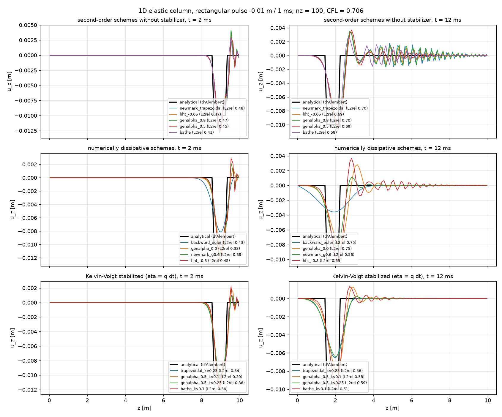
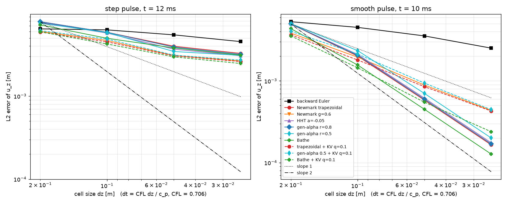
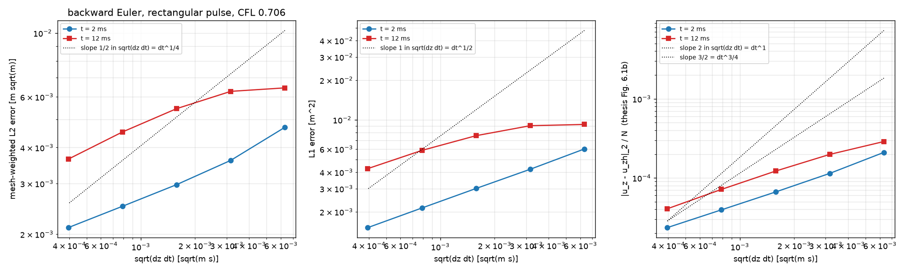

# Dynamic poromechanics: time integration of the inertia term

The poromechanics engine `engine_pm_cpu` (unstructured reservoir with the
`pm_discretizer`, contact mechanics by the penalty method with return mapping)
solves the quasi-static momentum balance by default. A run switches to the fully
dynamic momentum balance $\rho\,\ddot{\mathbf u} - \nabla\cdot\boldsymbol\Sigma
- \rho g\nabla z = 0$ by setting `engine.momentum_inertia` to the total density
$\rho$ (kg/m$^3$); `0` keeps the quasi-static form. This is how the
`displaced_fault_reactivation` model resolves the co-seismic phase of a fault
reactivation: quasi-static until the Newton loop fails near the nucleation point,
then dynamic steps of a few hundred microseconds.

The inertia term is integrated in time by one of the schemes below, selected on the
engine (`engine.time_integration`, an enum `darts.engines.time_integration`) or,
more conveniently, through
`darts.nonlinear_solvers.configure_time_integration(engine, scheme, **params)`.
All schemes are implicit, unconditionally stable (for the parameter ranges
given) and formulated with the displacements as the only unknowns, so the
contact (fault) rows, the flow rows, the Newton update and the linear solvers are
untouched; the quasi-static path is bit-identical to previous releases.

| `scheme` | Parameters | Order | Numerical dissipation | Notes |
|---|---|---|---|---|
| `backward_euler` (default) | – | 1 | very strong | legacy 3-point backward scheme on $u^{n-1}, u^n, u^{n+1}$ (`engine.Xn1`, `engine.dt1`); smears wave fronts (thesis Fig. 6.1) |
| `newmark` | `gamma` (0.5), `beta` (0.25) | 2 for $\gamma = 1/2$, else 1 | none for $\gamma = 1/2$; first-order damping for $\gamma > 1/2$, $\beta = (\gamma + 1/2)^2/4$ | Newmark-$\beta$ in displacement form (Chopra 2012; Jacobsen et al. 2024): $\ddot u^{n+1} = [u^{n+1} - u^n - \Delta t\,\dot u^n - \Delta t^2(\tfrac12 - \beta)\ddot u^n]/(\beta\Delta t^2)$, $\dot u^{n+1} = \dot u^n + \Delta t[(1-\gamma)\ddot u^n + \gamma\ddot u^{n+1}]$; unconditionally stable for $\gamma \ge 1/2$, $\beta \ge \gamma/2$ |
| `generalized_alpha` | `rho_inf` (0.8) | 2 | high-frequency, controlled by $\rho_\infty \in [0, 1]$ | Chung & Hulbert (1993): $\alpha_m = \frac{2\rho_\infty - 1}{\rho_\infty + 1}$, $\alpha_f = \frac{\rho_\infty}{\rho_\infty + 1}$, $\gamma = \tfrac12 - \alpha_m + \alpha_f$, $\beta = \tfrac14(1 - \alpha_m + \alpha_f)^2$; residual $\rho V[(1-\alpha_m)\ddot u^{n+1} + \alpha_m \ddot u^n] + (1-\alpha_f)F(u^{n+1}) + \alpha_f F(u^n)$ with $F(u^n)$ taken from the stored converged fluxes of the previous step |
| `hht` | `alpha` (−0.05), in $[-1/3, 0]$ | 2 | high-frequency | Hilber–Hughes–Taylor (1977) = generalized-$\alpha$ with $\alpha_m = 0$, $\alpha_f = -\alpha$ |
| `bathe` | `bathe_gamma` (0.5) | 2 | high-frequency, strong | Bathe (2007) composite scheme: trapezoidal rule over $\gamma\Delta t$, then the 3-point backward formula over the full step; two linear solves per step. Driven automatically as two engine sub-steps by `MechanicsNewtonSolver.run_timestep` (hook `on_substep` for time-dependent boundary data) |

Common option `kv_damping` = $q \ge 0$ (default 0): Kelvin–Voigt (stiffness-proportional)
artificial viscosity that adds $q\,K(u^{n+1} - u^n)$, i.e. $\eta_{KV} K \dot u$ with
$\eta_{KV} = q\,\Delta t$, to the momentum balance of the matrix cells (the practice of
dynamic-rupture codes, Day et al. 2005, where $q \approx 0.1$–$0.25$). It damps
grid-scale wavelengths irrespective of the time step and is the stabilizer that
removes the ringing behind sharp fronts (see below); it is first order in $\Delta t$ and
must be kept small ($q \lesssim 0.25$) to avoid smearing. Since $\eta_{KV} = q\,\Delta t =
(q\,\mathrm{CFL})\,\Delta z/c_p$, the damping is a grid-scale one when $q\,\mathrm{CFL} \approx 0.07$–$0.18$:
on the 1D benchmark this range (q = 0.1–0.25 at CFL 0.7, 0.05–0.1 at CFL 1.4, 0.25–0.5 at CFL 0.35)
brings the wake below 1–5 % of the pulse amplitude at the cost of a 15–35 % amplitude loss of a
7-cell step pulse; larger $q$ only smears.

The velocity and acceleration of the last converged step are available as
`engine.vel` and `engine.acc` (m/day, m/day$^2$; `ND * n_blocks`, matrix cells) and
`v_x, v_y, v_z` are written to the VTK output of dynamic runs. When a run switches
from quasi-static to dynamic mode the state is (re)initialised from rest by
`configure_time_integration` (`engine.reset_dynamic_state()`); a converged
quasi-static state has zero residual, so zero initial acceleration is consistent.
Variable time steps need no history beyond the previous level (except for the legacy
backward Euler scheme, whose 3-point formula is consistent only for
$\Delta t_n = \Delta t_{n-1}$), and a failed step leaves the velocity/acceleration
state untouched.

## Which scheme to use

Benchmark `models/elastic_wave_1d` (thesis Sec. 6.4.1): a 10 m elastic column,
$E = 1$ GPa, $\nu = 0.25$, $\rho = 2406$ kg/m$^3$, rollers, a rectangular
compression pulse of −0.01 m lasting 1 ms prescribed at the top; d'Alembert
solution for comparison. With 100 cells and CFL $= c_p\Delta t/\Delta z = 0.706$
(`python compare_schemes.py`):

| scheme | L2 error (rel., t = 12 ms) | overshoot (t = 2 ms) | wake behind the pulse (t = 12 ms) |
|---|---|---|---|
| backward Euler | 0.75 | 0 | 0.07 |
| Newmark trapezoidal | 0.70 | 0.29 | 0.18 |
| Newmark $\gamma = 0.6$ | 0.56 | 0.17 | 0.03 |
| HHT $\alpha = -0.3$ / generalized-$\alpha$ $\rho_\infty = 0.5$ | 0.69 | 0.25 | 0.14 |
| generalized-$\alpha$ $\rho_\infty = 0$ | 0.75 | 0.13 | 0.24 |
| Bathe | 0.59 | 0.27 | 0.16 |
| trapezoidal + Kelvin–Voigt $q = 0.25$ | 0.56 | 0.06 | $< 10^{-3}$ |
| generalized-$\alpha$ 0.5 + $q = 0.1$ | 0.58 | 0.15 | 0.04 |
| Bathe + $q = 0.1$ | 0.51 | 0.20 | 0.05 |

(overshoot and wake relative to the pulse amplitude.)



*All schemes against the analytical step wave at t = 2 ms and 12 ms (`compare_schemes.py`,
`models/elastic_wave_1d/figures/step_wave_comparison.png`).*

The non-dissipative
trapezoidal rule reproduces the "multiple spurious oscillations across the domain"
of the earlier attempt (thesis Fig. 6.2). The $\alpha$-schemes damp only the modes with
$\omega\Delta t \gg 1$; on a lumped-mass finite-volume grid the ringing behind a step
front lives at $\omega\Delta t \approx 2\,\mathrm{CFL}$, so at CFL $\lesssim 1$ it is a
spatial (dispersion) artefact that no second-order time scheme removes by itself.
Stiffness-proportional damping does remove it. Recommended for co-seismic fault
runs: `{'scheme': 'generalized_alpha', 'rho_inf': 0.5, 'kv_damping': 0.1}`
(one solve per step, annihilates the stiff contact-penalty modes, no wake) or
`{'scheme': 'bathe', 'kv_damping': 0.1}` (lowest error, two solves per step). Keep
`backward_euler` for regression references.

In the displaced-fault model the scheme is a configuration entry:

```python
config = {'mode': 'mixed', 'depletion': {'mode': 'well', 'value': -250.0}, 'friction_law': 'slip_weakening',
          'mesh_file': 'meshes/new_setup_coarse.geo',
          'time_integration': {'scheme': 'generalized_alpha', 'rho_inf': 0.5, 'kv_damping': 0.1}}
```

and `models/displaced_fault_reactivation/dynamic_benchmark.py` runs the mixed
quasi-static/dynamic case for a chosen scheme with per-step diagnostics of the
fault response (slip area, slip rate, seismic moment, traction roughness, Newton
counts).

## Verification (1D benchmark)



`models/elastic_wave_1d/convergence_study.py` produces the figure above and
`figures/convergence.md` (joint refinement nz = 50, 100, 200, 400 at CFL 0.706, L2
error of u_z against the d'Alembert solution before the first reflection). On the
rectangular pulse of the thesis every scheme is limited to observed orders of
0.4–0.5 (backward Euler 0.2): the exact solution is discontinuous and the error is
the spatial dispersion of the front, so the stabilized variants only lower the error
constant (Bathe + KV and Newmark γ = 0.6 lowest, 20–25 % below the trapezoidal rule).
On the smooth raised-cosine pulse the second-order schemes separate cleanly: the
successive-level orders of the trapezoidal rule, HHT, generalized-α and Bathe reach
1.8 on the finest levels (least-squares fits 1.6–1.7 over the whole range, Bathe with
the smallest constant), the first-order-dissipative variants (Newmark γ = 0.6, KV
damped trapezoidal / generalized-α) give 1.0–1.1, Bathe + KV 1.3, and backward Euler
0.2–0.5 (see the next paragraph for why the first-order scheme does not show a
first-order rate here).

### Why backward Euler shows less than first order here (thesis Fig. 6.1b)



`backward_euler_norms.py` (figure above, `figures/backward_euler_norms.md`) repeats the
thesis set-up for backward Euler alone — rectangular pulse, joint refinement at CFL 0.706,
nz = 50…800, errors at t = 2 ms and 12 ms plotted against $\sqrt{\Delta z\,\Delta t}$ as
in thesis Fig. 6.1b / ECMOR-2026 Fig. 2b. Three facts explain the apparent contradiction
with the "first order" of those figures:

- **The exact solution is discontinuous, so the measured rate is set by the error norm,
  not by the formal order of the integrator.** A first-order dissipative scheme smears the
  jump over a width $\delta \sim \sqrt{\nu t}$ with a numerical diffusion $\nu \propto \Delta t$,
  so the L1 error scales like $\delta \propto \Delta t^{1/2}$ and the mesh-weighted L2 error
  like $\sqrt{\delta} \propto \Delta t^{1/4}$, while the maximum error stays O(1) until the pulse
  amplitude is recovered. The measured orders at t = 2 ms are exactly these: L1 0.48–0.51,
  L2 0.25–0.28, L∞ ≈ 0. At t = 12 ms the same limits are approached from below (L1
  0.03 → 0.46, L2 0.04 → 0.31) because the pulse amplitude is still recovering (26 % of
  the exact amplitude at nz = 50, 81 % at nz = 800).
- **The thesis/paper figure plots a differently normalised error.** Its magnitudes
  (≈ 2.5e-4 at $\sqrt{\Delta z\Delta t}$ = 3.2e-3, ≈ 3e-5 at 3.2e-4) are reproduced by the
  Euclidean norm of the cell-error vector divided by the number of cells,
  $\|u_z - u_{zh}\|_2 / N$ (2.0e-4 and 4.1e-5 here at t = 12 ms), which equals the
  mesh-weighted L2 norm times $\sqrt{\Delta z}/H$ and therefore adds one half to the
  observed order: 0.75–0.81 against $\sqrt{\Delta z\Delta t}$ (which is $\propto \Delta z$ at
  fixed CFL), i.e. the slope that reads as "first order with respect to the square root
  of time step and cell size" in the thesis. The current backward Euler is the legacy
  three-point scheme unchanged (bit-identical regression references), so the two studies
  agree once the same quantity is compared; the mesh-weighted L2 norm of
  `convergence_study.py` is the one that carries the physical convergence rate.
- **On smooth data backward Euler is first order in time, but only asymptotically far
  beyond practical time steps.** Fixed mesh (nz = 100), raised-cosine pulse of 2 ms,
  Δt halved from CFL 0.706 (Δt = 100 µs) down to CFL 0.0055 (Δt = 0.78 µs): the
  Richardson orders from consecutive halvings are 0.05, 0.25, 0.47, 0.67, 0.81, 0.88 and
  approach 1, while the retained pulse amplitude goes 39 % → 52 % → 66 % → 78 % → 88 %
  → 94 % → 98 % → 99.6 %. The error is the
  amplitude loss $1 - \exp(-\omega^2 \Delta t\, t/2)$ of every mode, which is linear in Δt only
  once $\omega^2 \Delta t\, t \ll 1$ — for the 0.1–1 kHz content of a millisecond pulse over
  10 ms that means microsecond steps. At any step size a wave-propagation run can afford,
  backward Euler is in the pre-asymptotic regime where its error is dominated by
  dissipation, which is the practical argument for the second-order schemes above.

- **Order of accuracy** (smooth raised-cosine pulse, joint refinement at CFL 0.706,
  nz = 50…400): trapezoidal Newmark, generalized-α (ρ∞ = 0.8, 0.5), HHT (α = −0.05)
  and Bathe converge at 1.8 in L2, which is the rate of the spatial discretization
  (fixed-mesh temporal refinement gives 1.91–1.94 after removing the spatial error
  floor, and all three reach the same floor to 0.7 %); Newmark γ = 0.6 and the
  Kelvin–Voigt-damped trapezoidal rule are first order (q = 0.1 is dynamically
  equivalent to γ = 0.6: both have damping ratio 0.05 ω Δt to leading order);
  backward Euler is far from its asymptotic regime (observed 0.2–0.7) because it
  loses 16–70 % of the pulse amplitude (see the previous section). Bathe has the
  smallest error constant (0.77× trapezoidal) at twice the cost per step.
- **Discrete energy** (kinetic + strain, monitored through two reflections): the
  trapezoidal rule conserves it to machine precision (ratio 1.0000, largest
  step-wise increase 7e-16); every other scheme dissipates monotonically (no
  step ever increases the energy); Newton converges in one iteration per solve
  for this linear problem.
- **State handling**: a forced Newton failure rolls back to the last converged
  state without touching the velocity/acceleration state, and the resumed run is
  bit-identical to an uninterrupted one for every scheme (including a failure in
  either Bathe sub-step); switching a quasi-static run to dynamic mode gives the
  same bits as a run started dynamic.
- **Bathe consistency**: the sub-step identities (trapezoidal sub-step,
  three-point backward sub-step, rotation of `Xn1/Xn` and `vel_n1/vel`) hold to
  1e-14 in a quasi-static ramp test at 11 and 114 steps per period of the column's
  fundamental mode; Bathe is the scheme closest to a converged dynamic reference,
  while backward Euler damps and delays the transient (26 % at 114 steps per
  period). Bathe's Kelvin–Voigt viscosity acts per sub-step (η = q γ Δt), so a
  Bathe run needs q ≈ 1.5× that of a single-step scheme for the same damping.
- **Step response versus CFL** (rectangular pulse, CFL 0.35–4): Newmark γ = 0.6 gives
  the cleanest front per linear solve at every CFL (zero overshoot, wake 3–8× below
  Bathe, 10–25 % amplitude loss); Bathe is cleaner than the trapezoidal rule at the
  same Δt with a mild optimum at CFL 1–1.4, but on a 7–14-cell pulse the spatial
  dispersion dominates, so the literature claim of a clean step response needs
  ≥ 20–40 cells per pulse.

## Co-seismic fault runs

`dynamic_benchmark.py` (mixed run, well depletion, coarse mesh, 1500 dynamic
steps of 0.5 ms) shows the same rupture sequence for every scheme — nucleation on
the two reservoir-corner patches, rupture of the whole fault within ~0.15 s, arrest
with ~0.4 m of slip and peak slip rates of ~10 m/s (consistent with a 10–20 MPa
stress drop and the shear impedance G/2c_s ≈ 2 MPa·s/m) — with backward Euler
lagging the second-order schemes by 20–30 ms, as in the 1D ramp test. Two
practical points:

- The Newmark-family Jacobians carry the mass term ρV/(βΔt²), four times larger
  than backward Euler's ρV/Δt², so GMRES + FS-CPR needs about a third of the
  iterations (25–30 versus 75 per Newton iteration on the coarse mesh, measured
  with the FS-CPR hierarchy that was built on the quasi-static stiffness matrix;
  see the next section for why the solver should be rebuilt at the switch).
- At the rupture front the penalty return mapping can chatter between stick and
  slip on successive Newton iterations. Backward Euler escapes by cutting Δt (a
  frozen matrix makes the constraint trivially satisfiable), but a velocity-state
  scheme cannot be relaxed that way: the free-flight motion u^n + Δt v^n is imposed
  at any Δt, and below ~1e-6 s the 1/(βΔt²) amplification of displacement
  round-off floors the momentum residual at ~1e-4. The driver therefore redoes a
  dynamic step that failed after two cuts with backward Euler and returns to the
  selected scheme afterwards (`run_python` in `displaced_fault_reactivation/main.py`;
  the count is reported as `n_be_fallbacks`). A state-freezing or line-search
  strategy inside the contact Newton loop would be the systematic cure.

## Full quasi-static → dynamic → quasi-static run

`models/displaced_fault_reactivation/run_full.py` runs the complete sequence of the
well-depletion, slip-weakening case on one mesh: quasi-static production until the
Newton loop fails at nucleation, the fully dynamic co-seismic stage, and — once the
slipping area has dropped below 0.5 % of its peak after at least 100 dynamic steps —
the return to quasi-static stepping (inertia off, quasi-static solver re-injected, Δt
restarted from 1e-3 days) with production continuing to the end of the schedule. It
writes the VTK output, the fault-profile animation (`fault_video.mp4`, from
`main.plot_profiles`) and `run_full.json` with the per-step rupture diagnostics;
`compare_resolutions.py` compares two runs (slipping area, maximum slip and slip rate
and rupture-front extent against the time since nucleation, slip profiles at chosen
times, a side-by-side animation).

Coarse mesh (11 172 cells), backward Euler, cuDSS in both stages, 20 days of
production: nucleation at day 11.65 on the two reservoir-corner patches, whole-fault
rupture between 0.18 s and 0.33 s after nucleation (peak slip rate 10 m/s), arrest at
0.488 s with 0.391 m of slip after 1 420–1 490 dynamic steps, then 20 quasi-static steps
to day 20 with no further slip except a marginal 0.8 % of the fault at day 15. Three
independent runs (two single-threaded, one with 8 assembly threads) give the same
trajectory to plotting accuracy; wall times 1 195 s, 1 355 s and 951 s (the run is
assembly-bound: 606 s of the 1 195 s single-threaded). The multithreaded assembly of
`engine_pm_cpu` had two data races (see the CHANGELOG) and was unusable before this
fix — an 8-thread run produced no rupture at all; it is now bit-identical to the
single-threaded one.

Fine mesh (115 872 cells, 465 632 unknowns), same set-up, cuDSS in both stages and 16 assembly threads:
the whole cycle takes 5.2 h (3 228 timesteps, 417 of them wasted, 6 564 Newton iterations; 5 258 s of Jacobian
assembly, 4 022 s of cuDSS factorization and 282 s of triangular solves, so the run is assembly- and
factorization-bound). Refining the fault changes the rupture measurably: nucleation is **delayed by 1.2 days**
(day 12.850 versus day 11.654), the co-seismic stage lasts 25 % longer (0.613 s versus 0.488 s over 3 193
dynamic steps), the final slip is 18 % larger (0.460 m versus 0.391 m) and the peak slip rate is ~10 % lower
(9.2 m/s versus 10.1 m/s) — the coarse mesh triggers earlier, and its shorter co-seismic stage follows in part
from its shorter fault rather than from resolution alone (see below). The fine run also
exercised the timestep-floor escape once, at slip area 0.073: the dynamic stage stalled, the driver returned to
quasi-static stepping, the quasi-static Newton loop then failed again and re-entered the dynamic stage, which
this time arrested naturally at zero slipping area. Both runs then step quasi-statically to day 20 (20 and 19
steps) with no further slip.

`compare_resolutions.py` puts two runs side by side (`rupture_propagation.png`, `slip_profiles.png` and a
`rupture_comparison.mp4` of the slip and slip-rate profiles). Comparing the coarse and fine runs separates what
is already converged from what is not. The rupture **speed** is converged: the actively slipping patch (slip
rate above 0.01 m/s) grows at 916 m/s on the coarse mesh and 926 m/s on the fine one, about 0.56 of the shear
wave speed, i.e. sub-Rayleigh in both cases. The two runs are **not** a pure refinement pair, however:
`new_setup_coarse.geo` sets `Lplus = b + 20` against `b + 100` in `new_setup_fine.geo`, so its fault is 340 m
long where the fine one is 500 m. The measured extents — 337 m (coarse, depths 2081–2419 m) and 499 m (fine,
2000–2500 m) — are those two faults themselves, each less one cell (2·Lplus minus the fault cell size
reproduces both to better than 0.1 %), and both runs reach a slipping-area fraction of 1.0, i.e. both rupture
their whole fault. The extent difference, and the 0.37 s versus 0.53 s growth phase that follows from it, are
therefore geometry rather than resolution, and the coarse run is context rather than a convergence level. What
the pair does show is a nucleation effect: the coarse mesh nucleates 1.2 days earlier (day 11.654 against
12.850), breaks out later relative to its own nucleation — 0.15 s after nucleation it has slipped 4.8 mm where
the fine mesh has already slipped 91 mm — and ends at 0.39 m of slip against 0.46 m. So the coarse mesh
under-resolves the nucleation patch, while the propagation speed itself is mesh-independent.

The refinement sequence proper is `new_setup_fine.geo` → `new_setup_lc50.geo` → `new_setup_ultra_fine.geo`.
All three share `Lplus = b + 100` (a 500 m fault) and refine it through the characteristic length `lc` and the
fault-line multiplier `mult1` (the fault points are placed at `mult1 · lc`; `mult` controls the reservoir
boundary, not the fault):

| mesh | `lc` | `mult1` | fault cell | fault cells | wedge cells |
|---|---|---|---|---|---|
| `new_setup_fine.geo` | 100 | 0.01 | 0.995 m | 534 | 115 872 |
| `new_setup_lc50.geo` | 50 | 0.01 | 0.499 m | 1 066 | 458 766 |
| `new_setup_ultra_fine.geo` | 100 | 0.001 | 0.0999 m | 5 325 | 2 063 112 |

The 459 k run (cuDSS in both stages, 16 assembly threads, capped at 1 200 dynamic steps) nucleates at day
13.047, 0.197 days after the fine mesh, and the 2.06 M run at day 13.064, another 0.017 days later: the
nucleation day converges. The co-seismic rupture of the 459 k run is a pure time shift of the fine one. Breakout
(maximum slip rate above 1 m/s) and every slipping-area milestone — 10, 50, 90 and 99 % of the fault — come
0.0965 s later on the 459 k mesh (±1 ms; breakout 0.2170 s against 0.1205 s after the start of the dynamic
stage, full rupture 0.4305 s against 0.3340 s). The peak slip rate is 9.200 against 9.187 m/s, the rupture front
runs at 974 against 933 m/s (`front_extent`, endpoint estimate; 1 021 against 1 006 m/s fitted over 20–80 % of
the extent), and about 0.07 s after full rupture the maximum slip is 0.428 against 0.426 m and the moment 4.66
against 4.63 × 10¹⁴ N·m/m. So by 116 k cells the propagation is converged; what still moves with the fault
resolution is the nucleation — the day it starts, and the quiet interval between the start of the dynamic stage
and breakout. The 459 k run takes 4.81 h for 1 228 steps (35 wasted, 2 525 Newton iterations), 5 947 s of it
cuDSS factorization (2.36 s per Newton iteration) and 1 551 s Jacobian assembly; it stops at the step cap with
95 % of the fault still slipping, so it has no arrest (0.447 m of slip at the cap, against 0.460 m at the fine
run's arrest).

## Linear solvers for the two stages

`config['linear_solver'] = {'quasi_static': <name>, 'dynamic': <name>}` selects the
solver of each stage of the displaced-fault model (`Model.make_stage_solver_spec`:
`fs_cpr`, `superlu`, `pardiso`, `cudss`, `gpu_gmres_ilu0[_sp]`, `gpu_cusolver`, or a
`LinearSolverSpec`). The dynamic-stage solver is rebuilt and re-injected at the rupture
switch through `model.linear_solver.update_solver(spec=...)`, against the existing
Jacobian; the GPU solvers run on the CPU-assembled Jacobian through
`linsolv_host_adapter` (see `solvers.md`, "Linear solvers — GPU"). Three findings from
the well-depletion case (coarse mesh, 11 172 cells / 45 192 unknowns, backward Euler,
300 dynamic steps of 0.5 ms, one OpenMP thread, A100 shared with other jobs):

- **Rebuild FS-CPR at the switch.** The open-source `linsolv_fs_cpr` sets up its
  displacement-block AMG once (first setup) and reuses it, so the solver that ran the
  quasi-static stage carries a hierarchy built for the stiffness matrix into the
  inertial stage, where the Jacobian gains ρV/Δt² on the diagonal. Tightening that
  solver in place (`'dynamic': 'inplace'`, the previous behaviour) costs ~50 GMRES
  iterations per Newton step and 1812 s; the same GMRES + FS-CPR rebuilt at the switch
  needs ~10 and 391 s. This is now the default.
- **cuDSS is the fastest solver for both stages on this mesh family.** cuDSS for both
  stages runs the case in 163 s (quasi-static 29 s, dynamic 134 s, of which 90 s is the
  CPU Jacobian assembly and 18 s the factorizations); cuDSS + rebuilt FS-CPR 354 s;
  FS-CPR + GPU GMRES/block-ILU(0) 255–271 s. Every variant reproduces the same rupture
  (312 timesteps, 10 wasted, final slip 4.9–5.0 mm, peak slip rate 0.038–0.039 m/s at
  the end of the 300 steps). GPU GMRES + block-ILU(0) converges in 2–5 iterations on
  the mass-dominated dynamic Jacobians but stalls on the quasi-static one (500
  iterations, relative residual 0.03–0.1), so it is a dynamic-stage option only. Once
  the solve is cheap the run is assembly-bound (0.19 s per Newton step here).
- **Reproducibility.** cuDSS solves are accurate (true relative residual 1e-14 to
  1e-16 in 400 repeated solves, identical to SuperLU to seven digits) but not
  bit-reproducible run to run (1e-11 relative). The model's well-control residual sits
  at its round-off floor (the equation is O(1e12) at the depletion onset) right at the
  Newton well tolerance, so two identical cuDSS runs can diverge at the first
  depletion step: one converges in three iterations and ruptures at day 11.65 like the
  FS-CPR and SuperLU runs, the other fails the step, cuts Δt and follows a path that
  does not slip within the 20-day window. FS-CPR and SuperLU are deterministic and
  always take the first path. Runs that must be reproducible should keep a
  deterministic solver, or the well residual should be made relative.

Single-assembly solves (setup + solve of one Jacobian at the converged one-day state
for the coarse mesh, at the initial state for the larger meshes; one OpenMP thread):

| mesh (cells / unknowns) | Jacobian | GMRES + FS-CPR (1e-10) | cuDSS | GPU GMRES + ILU(0) | SuperLU |
|---|---|---|---|---|---|
| coarse (11 172 / 45 192) | quasi-static | 0.5–2.0 s, 15 it | 0.05–0.15 s | diverges (500 it) | 15.5 s |
| coarse | dynamic (BE / gen-α) | 0.10–0.55 s, 2–5 it | 0.04–0.08 s | 0.01–0.12 s, 2–5 it | 16.8 s |
| fine (115 872 / 465 632) | quasi-static | 95 s, 74 it (180 s, 142 it at 1e-12) | 0.97 s (3.7 GB GPU) | diverges (500 it) | — |
| fine | dynamic (BE / gen-α) | 7.7–10.0 s, 5 it (AMG setup dominated) | 0.47–0.86 s | 0.15–0.34 s, 8–12 it | — |
| coarse_longer (161 574 / 650 144) | quasi-static | 212 s, 122 it (479 s, 284 it at 1e-12) | 1.24 s (4.9 GB GPU) | diverges (500 it) | — |
| coarse_longer | dynamic (BE / gen-α) | 11–18 s, 5–7 it | 0.6–0.7 s | 0.3–0.8 s, 8–12 it | — |
| lc50 (458 766 / 1 839 336) | quasi-static (initial state) | fails (hard failure after 58 s) | 3.0 s (14.2 GB GPU) | diverges (500 it) | — |
| lc50 | dynamic (gen-α) | 48 s, 5 it | 2.3 s | 1.1 s, 13 it | — |
| lc50 | dynamic (BE) | 55 s, 5 it | 3.1 s | not converged (500 it, 2e-6) | — |

Two trends decide the choice at the ~1M-cell scale. The FS-CPR iteration count on
the quasi-static Jacobian grows with the mesh (15 → 74 → 122 iterations from 11 k to
162 k cells, i.e. the displacement-block systems-AMG does not stay mesh-independent on
this one-layer wedge/hex mesh), and each iteration costs ~1.5 s at 650 k unknowns on
one thread, so a 1M-cell quasi-static solve is of the order of 10³ s. cuDSS, in
contrast, sees a single extruded layer (a 2D graph topologically), so its
factorization fills like a 2D problem: 0.05 s → 1.0 s → 1.2 s → 3.0 s and 0.8 → 3.7 →
4.9 → 14.2 GB of GPU memory from 11 k to 459 k cells (1.84 M unknowns), i.e. roughly
7 s and 30 GB at 1M cells, where the CPU FS-CPR already failed on the initial-state
quasi-static Jacobian at 459 k cells and needs 50 s per dynamic solve (AMG setup
dominated). The 930 k-cell mesh (lc = 35 m, 3.7 M
unknowns) could not be benchmarked: `pm_discretizer.init` throws `vector::reserve`
(a length error, i.e. an index overflow in the stencil storage) at that size, so the
largest system measured is 459 k cells.
For a genuinely 3D mesh at 1M cells the LU fill of a 4-dof problem is prohibitive and
FS-CPR (CPU, multi-threaded) remains the quasi-static solver; the dynamic stage can
use cuDSS or GPU GMRES + block-ILU(0) (8–12 iterations, 0.15–0.8 s at 0.5–0.65 M
unknowns) in either case. The host-to-device copy of the Jacobian values is 14 MB
(coarse) to 190 MB (fine) per Newton iteration, 0.01–0.02 s on the coarse mesh, and is
never the bottleneck; the CPU assembly is (0.19 s per Newton iteration at 11 k cells,
1.3–3.5 s at 116–162 k). The model construction (unstructured preprocessing +
`pm_discretizer`) scales about linearly: 75 s at 11 k cells, 930 s at 116 k, 1100–1300 s
at 162 k.

## Implementation notes

- Assembly (`engine_pm_cpu::assemble_jacobian_array` and the time-dependent
  discretization variant): for matrix cells the inertia residual
  $\rho V[(1-\alpha_m)\ddot u^{n+1}(u^{n+1}) + \alpha_m\ddot u^n]$ is added with the
  diagonal Jacobian $\rho V(1-\alpha_m)\,\partial\ddot u^{n+1}/\partial u^{n+1}$
  ($= 1/(\beta\Delta t^2)$ for the Newmark family, $c_3^2$ for the second Bathe
  sub-step); the internal-force Jacobian entries of those rows are scaled by
  $(1-\alpha_f) + q$ (displacement columns) and $(1-\alpha_f)$ (pressure column),
  and the residual gets $\alpha_f[F(u^n) - F(u^{n+1})] + q\,K(u^{n+1}-u^n)$. Fault
  (contact) rows are overwritten by the contact assembly and stay fully implicit
  constraints at $t^{n+1}$; well rows are untouched. Units: displacement m,
  pressure bar, time days (`BAR_DAY2_TO_PA_S2` converts $\rho V \ddot u$ to bar·m$^2$).
- `post_newtonloop` commits $\dot u^{n+1}, \ddot u^{n+1}$ (`commit_dynamic_state`)
  before rotating `Xn`; a rejected step changes nothing.
- The Bathe second sub-step uses `Xn1`/`vel_n1` (level $n$) and `Xn`/`vel`
  (level $n+\gamma$); a failed second sub-step leaves the engine at
  $t^{n+\gamma}$ and the driver simply continues from there.
- `models/elastic_wave_1d` uses a column two cells wide: on a one-cell-wide column
  the roller side faces make the in-plane gradient reconstruction of
  `pm_discretizer` degenerate ($\sim 10^{30}$ entries in the $u_x, u_y$ rows).

References: Newmark (1959); Hilber, Hughes & Taylor (1977); Chung & Hulbert (1993);
Bathe (2007), Bathe & Noh (2012); Day, Dalguer, Lapusta & Liu (2005); Jacobsen,
Berre, Nordbotten & Stefansson (2024, MPSA–Newmark); Novikov (PhD thesis, TU Delft,
Ch. 6).
